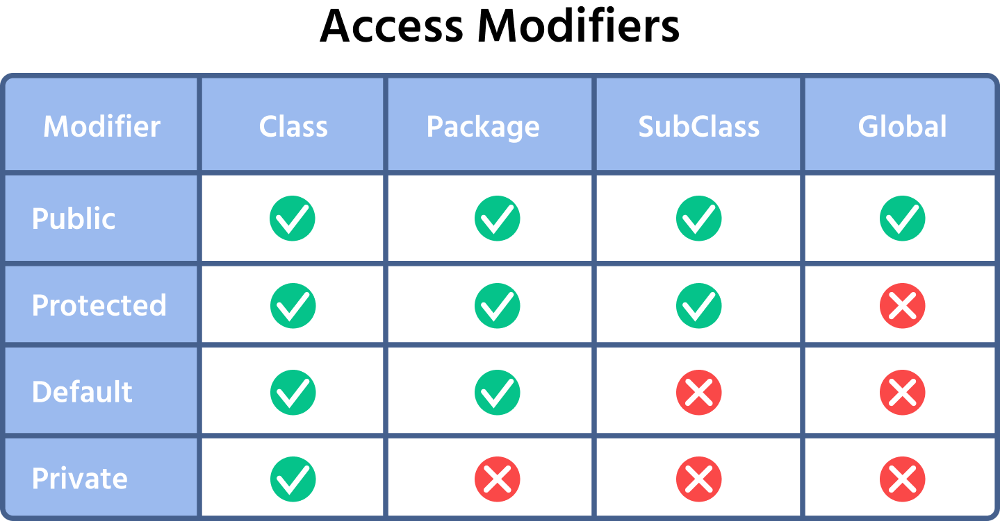

# Object Oriented Programming

**Q) What is OOPs? <br/>**
OOP is a programming paradigm where we design programs around objects that
     represents real-world or conceptual entities.

Object = Characteristics (Data) & Behaviours (Member Functions)

Local Variables | Instance Variables | Reference Variables

**Q. Why there is no default value for local variables but for instance variable in Java?** <br/>
Instance variables are part of an object, and objects state needs to be initialised
when the object is created.
Local variables are used only within a method or block and have a limited scope.
Therefore, java requires local variables to be explicitly initialized before they
are used, preventing accidental use of an uninitialized value.


## Constructors
_Rules for Constructor_
1. Same name as Class.
2. No return type. Not even Void.
3. Automatically called during Object creation
4. Used to initialize an Object
5. It can also be Overloaded

**Mental Model** 
```java
    Student s = new Student();
   // new       ---> object creation
   // Student() ---> Constructor call 
```
In Java, Constructor is **Mandatory.** => Default Constructor

Java provide default constructor automatically. 

Default Constructor sirf tabhi banta hai jab aap koi constructor khud se define nahi karte ho.

Agar tumne parameterized constructor bana dia, toh Object creation ke time par tumhe values pass
karne padenge kyonki koi default constructor java provide hi nahi karega. 

Agar value pass karna nahi chahte...toh hum karenge constructor ko **Overload** by creating default constructor manually.

### this keyword 
* Referes to the current object - Current Object ke Reference store karta hai
* this() -> used to call other constructors of the same object. Should always present at the beginning of Constructor body
    

**Q) Can we call constructor manually?**

Ans. No. 

**new** -> It creates object dynamically(at Runtime);

## Object Deep Dive

Size of **Ref.** Variables - **4bytes** or **8bytes** depends on JVM to JVM on a Machine. But generally **4bytes.**

**CallByValue v/s CallByReference -**
Java is always pass by value. Also for reference types. 

In **Shallow copy** only another reference is created but points to the same object.

In **Deep copy**, another new object is created using new keyword but the actual object value is copied to the newly created object.
```java
Random r = new Random(10,20);
Random r1 = new Random(r); //Deep Copy
Random r2 = r; //Shallow Copy
```

### Static & Final In Java
**Q) What is **static** keyword?**  
* It indicates that a member(variable, method, block, or nested class) belongs to the **class itself** rather than to any specific instace(object) of that class.<br/>

* When you declare something as static, memory is allocated only once when the class is loaded. 

* Any member declared with static not allocated to Heap memory.Also static method are also not stored in heap memory.
* The instance variable declared with static keyword is called as **class variable** 

Rules for static
1. One static method can only call other static method
2. Static method can only access static variables
3. Doesn't have acess to **this** keyword

**static{}** - Used to **initialize the the static variables** in a Class. Like constructor used for primitive ones. Runs first when class loads.
```java
static{
     college = "IGIT, Sarang";
}
```
* Parameters **can't** be static.
* Class **can't** be static. If the class is internal or nested class then it can be **static**.

**Q) What is **Final** keyword?**
* It is a non-access modifier used to restrict further modification of a variable, method, or class.
```java
final double PI = 3.14; // Also called as Constants.
// Nomenclature - All constants should be capital.
```
* final keyword can be used with **varibles, methods, class, parameters**

**Q) Why main() in Java is static?**<br/>
Because JVM directly can call the main() using the className. NO need to create the object.
```java
//It is possible to create a varible static as well as final
static final double PI = 3.14;
```

### Encapsulation & Inheritance
**Q) What is Encapsulation?**<br/>
* Encapsulation is fundamental OOP concept that bundles variables (data) and methods (behaviour) into a single unit, typically a class.
* We should **NOT** provide unrestricted acess of data.

**Access Modifiers -** says who have acess to Variables, Method, Constructor, Class



**Package -** Group similar classes/interfaces together

NOTE - We Can't Decalare a Root level class as Private or Protected. 
```java
protected class Main{
    //This is wrong because class doesn't belong to anyone.
}
private class Main{
     //This is wrong because class doesn't belong to anyone.
}
```
